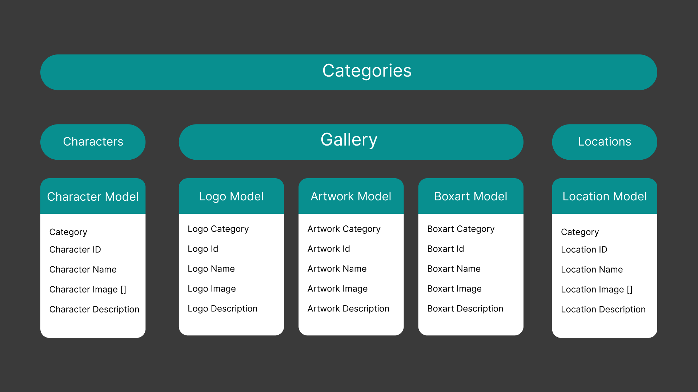

<h1 align="center">Yakuza API</h1>
<p align="center">A restFUL API serving data from the Yakuza Series</p>

## Overview

This API's purpose is to serve character, location, and media assets to developers. The idea is to give Web Developers another free media asset resource to use for their passion and learning projects.

You can request a one entry, all entries, or a random entry from one of two categories.

character or location

```
GET https://rest-api-jvtz.onrender.com/character/1
```

To get started, take a look at the <a href="https://yakuza-api.netlify.app">documentation</a>

## Technologies Used


<br/>

## Data Structure



While the Data Structure is very simple, I still feel it was necessary to build some kind of plan. I needed to create a data structure that can easily be scalled with an infinite amount of data.

## Copyright

Copyright 2024 Dylon Crowley-Perez

Permission is hereby granted, free of charge, to any person obtaining a copy of this software and associated documentation files (the "Software"), to deal in the Software without restriction, including without limitation the rights to use, copy, modify, merge, publish, distribute, sublicense, and/or sell copies of the Software, and to permit persons to whom the Software is furnished to do so, subject to the following conditions:

The above copyright notice and this permission notice shall be included in all copies or substantial portions of the Software.

THE SOFTWARE IS PROVIDED "AS IS", WITHOUT WARRANTY OF ANY KIND, EXPRESS OR IMPLIED, INCLUDING BUT NOT LIMITED TO THE WARRANTIES OF MERCHANTABILITY, FITNESS FOR A PARTICULAR PURPOSE AND NONINFRINGEMENT. IN NO EVENT SHALL THE AUTHORS OR COPYRIGHT HOLDERS BE LIABLE FOR ANY CLAIM, DAMAGES OR OTHER LIABILITY, WHETHER IN AN ACTION OF CONTRACT, TORT OR OTHERWISE, ARISING FROM, OUT OF OR IN CONNECTION WITH THE SOFTWARE OR THE USE OR OTHER DEALINGS IN THE SOFTWARE.
